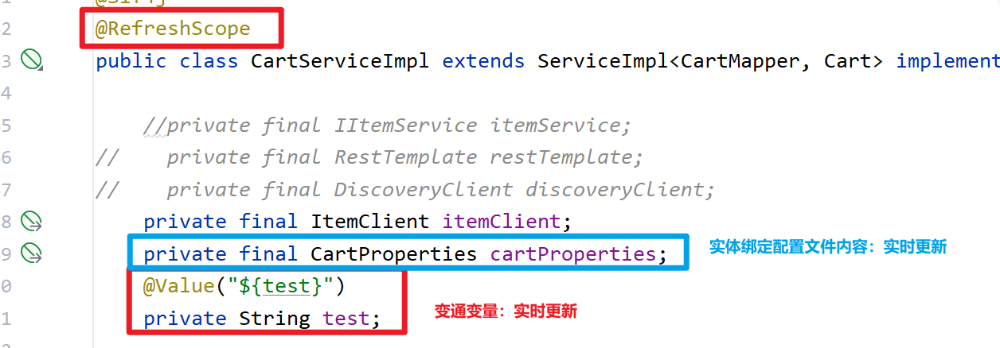
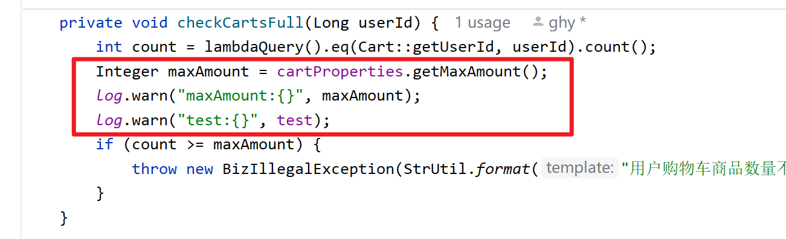

# 一、OpenFeign调用如何拦截请求，改变请求相关信息

## 1、RequestInterceptor

> 能够拦截每个OpenFeign请求，并执行内部的apply方法
>
> - 在apply方法中就可以改变请求相关信息


# 二、跨域问题

## 1、域

> 域由三部分组成：协议、IP、端口

> 三部门都相同，则为同域。
>
> 同域示例：
>
> - http://localhost:8081/items     http://localhost:8081/carts
> - http://10.31.10.11/items     http://10.31.10.11:80/carts

> 至少有一个不同，就形成了跨域。
>
> - 在发起Ajax请求时，出现跨域会违反浏览器的同源策略，造成正常功能受影响
>   - 出现了Ajax请求跨域问题是，是请求能够到达目标接口，但是响应无法返回
> -  同源策略（Same origin policy）是一种约定，它是浏览器最核心也最基本的安全功能，如果缺少了同源策略，则浏览器的正常功能可能都会受到影响。可以说Web是构建在同源策略基础之上的，浏览器只是针对同源策略的一种实现。 
>
> 跨域示例：
>
> - http://localhost/items     https://localhost/carts     协议不同
> - http://10.31.10.11/items     http://10.31.10.12/carts    IP不同
> - http://localhost:8081/items     http://localhost:8082/carts      端口不同


## 2、SpringMVC解决跨域问题

在控制器上增加注解 `@CrossOrigin`


## 3、网关解决跨域问题

application.yml 增加如下配置

```yml
spring:
  cloud:
    gateway:   
      # 。。。
      globalcors: # 全局的跨域处理
        add-to-simple-url-handler-mapping: true # 解决options请求被拦截问题
        corsConfigurations:
          '[/**]':
            allowedOriginPatterns:  # 允许哪些网站的跨域请求，写通配符
              - "*"
            #allowedOrigins:  # 允许哪些网站的跨域请求，写精确域名
            #  - "http://localhost:8888"
            allowedMethods: # 允许的跨域ajax的请求方式
              - "GET"
              - "POST"
              - "DELETE"
              - "PUT"
              - "OPTIONS"
            allowedHeaders: "*" # 允许在请求中携带的头信息
            allowCredentials: true # 是否允许携带cookie
            maxAge: 360000 # 这次跨域检测的有效期
```

>  Controller上就无需配置


4、Nginx也可以配置跨域

```sh
server {
    listen 80;
    server_name yourdomain.com;
 
    location /api/ {
        # 允许所有源跨域访问
        add_header 'Access-Control-Allow-Origin' '*' always;
        add_header 'Access-Control-Allow-Methods' 'GET, POST, PUT, DELETE, OPTIONS';
        add_header 'Access-Control-Allow-Headers' 'Content-Type, Authorization, X-Requested-With';
        add_header 'Access-Control-Allow-Credentials' 'true';
 
        # 如果使用Nginx作为反向代理，请添加相应的proxy_pass配置
        # proxy_pass http://backend-server:port/api/;
 
        # 其他配置...
    }
}
```


# 三、配置中心

## 1、配置统一管理

### 1、在配置中心创建配置文件

- shared-jdbc.yml

```yml
spring:
  datasource:
    url: jdbc:mysql://${hm.db.host}:3306/${hm.db.name}?useUnicode=true&characterEncoding=UTF-8&autoReconnect=true&serverTimezone=Asia/Shanghai
    driver-class-name: com.mysql.cj.jdbc.Driver
    username: root
    password: ${hm.db.pw}
mybatis-plus:
  configuration:
    default-enum-type-handler: com.baomidou.mybatisplus.core.handlers.MybatisEnumTypeHandler
  global-config:
    db-config:
      update-strategy: not_null
      id-type: auto
```

- shared-log.yaml

```yml
logging:
  level:
    com.hmall: debug
  pattern:
    dateformat: HH:mm:ss:SSS
  file:
    path: "logs/${spring.application.name}"
```

- shared-swagger.yaml

```yml
knife4j:
  enable: true
  openapi:
    title: ${hm.title}
    description: ${hm.description}
    email: zhanghuyi@itcast.cn
    concat: 虎哥
    url: https://www.itcast.cn
    version: v1.0.0
    group:
      default:
        group-name: default
        api-rule: package
        api-rule-resources:
          - ${hm.packageStr}
```


### 2、本地微服务【cart-service】

- bootstrap.yaml

```yml
spring:
  application:
    name: cart-service
  profiles:
    active: local
  cloud:
    nacos:
      config:  #配置中心
        server-addr: localhost:8848  #配置中心地址
        file-extension: yaml  #配置中心中配置文件的后缀
        shared-configs:
          - data-id: shared-jdbc.yaml  #需要拉取的配置文件名称
          - data-id: shared-log.yaml  #需要拉取的配置文件名称
          - data-id: shared-swagger.yaml  #需要拉取的配置文件名称
```

- application.yaml

```yml
server:
  port: 8082
spring:
  cloud:
    nacos:
      discovery:
        server-addr: localhost:8848
feign:
  okhttp:
    enabled: true
```

- application-local.yaml

```yml
hm:
  db:
    host: localhost
    pw: root # 修改为自己数据库的密码
    name: hm-cart
  title: 黑马商城购物车服务接口文档
  description: 黑马商城购物车服务接口文档
  packageStr: com.hmall.cart.controller
```


## 2、配置实时更新

当 配置中心有 `微服务名称.yml` 文件时，本地微服务会从配置中心中去拉取该内容

### 1、配置中心创建配置文件

- cart-service.yaml

```yml
hm:
  cart:
    maxAmount: 1 # 购物车商品数量上限
test: TEST
```

### 2、本地购物车服务

#### 1、新建一个 CartProperties

```java
@Data
@Component
@ConfigurationProperties(prefix = "hm.cart")
public class CartProperties {
    private Integer maxAmount;
}
```

#### 2、修改 CartServiceImpl 的代码






### 3、两种情况

- 实体绑定配置文件内容：配置中心会实时更新
- 普通变量获取配置：需要类上标记@RefreshScop和变量上标记@Value注解，才能实时更新


# 四、服务保护

## 1、服务雪崩

微服务之间调用是很复杂的。

一个完整的业务功能，可以会出现多个服务的调用通信

那么由于一个服务出现了问题，导致调用它的那个服务也出现了问题，这种出现级联失败的情况，叫服务雪崩

