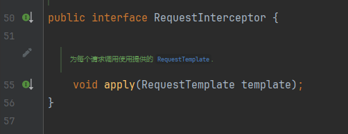

# 三方调用框架-OpenFeign

## 前言

[服务注册和发现-nacos](https://yiyan.baidu.com/)

使用此调用三方服务前需使用`nacos`将服务注册到服务中心

## 一、OpenFeign是什么？

pring Cloud OpenFeign是一种基于Spring Cloud的声明式REST客户端，它简化了与HTTP服务交互的过程。往常Spring自带的`RestTeamplate太过繁琐`，OpenFeign可以通过`注解`的方式来声明请求参数、请求方式、请求头等信息。调用自身接口更为便捷`只要配置和注解`就可以，同时，它还提供了`负载均衡`和`服务发现`等功能，Spring Cloud OpenFeign能够提高应用程序的可靠性、可扩展性和可维护性，是构建微服务架构的重要工具之一。

## 二、OpenFeign调用如何拦截请求

在OpenFeign中有`RequestInterceptor`这样一个接口，其内部只有一个`apply`方法，该方法能够拦截每一个OpenFeign的请求

``RequestInterceptor接口``



当我们想拦截OpenFeign请求做验证和操作时，可以写一个配置类，注入容器即可。在其内部的apply方法重写即可写入自己想要做的操作

``OpenFeign拦截``

```java
@Configuration
public class FeignConfig {
    @Bean
    public RequestInterceptor requestInterceptor(){
        //OpenFeign调用有没有校验Token？？？ No
        return new RequestInterceptor() {
            @Override
            public void apply(RequestTemplate template) {
                //验证当前用户，将userId放入user-info请求头中
                Long userId = UserContext.getUser();
                if (userId != null) {
                    template.header("user-info", userId.toString());
                }
            }
        };
    }
```

## 三、OpenFeign快速开始

### 1.导入依赖

```xml
  <!--openFeign-->
  <dependency>
      <groupId>org.springframework.cloud</groupId>
      <artifactId>spring-cloud-starter-openfeign</artifactId>
  </dependency>
  <!--负载均衡器-->
  <dependency>
      <groupId>org.springframework.cloud</groupId>
      <artifactId>spring-cloud-starter-loadbalancer</artifactId>
  </dependency>
```

### 2.启动OpenFeign

在启动类上添加注解`@EnableFeignClients`。当调用自身服务不在同一模块中时，需要在注解添加扫描参数，参数结果为被调用Client接口包路径

``启动类``

```java
//com.api.client为写的client接口包路径
@EnableFeignClients(basePackages = "com.api.client")
@MapperScan("com.trade.mapper")
@SpringBootApplication
public class TradeApplication {
    public static void main(String[] args) {
        SpringApplication.run(TradeApplication.class, args);
    }
}
```

### 3.编写具体调用接口

当前面两步弄好之后，就可以创建具体的调用接口了，前提需要保持`请求路径，方法类型，方法参数一致！！！`

``client接口``

```java
//trade-service为注册到nacos的服务名称，必须保持一致
//configuration = FeignConfig.classs使用FeignConfig类的配置
@FeignClient(value = "trade-service",configuration = FeignConfig.class)
public interface TradeClient{

    //put请求方法	/orders/{orderId}请求路径	@PathVariable("orderId")参数一致
    @PutMapping("/orders/{orderId}")
    void markOrderPaySuccess(@PathVariable("orderId") Long orderId);
}
```

## 四、解决三方调用发生的跨域

### 1.域

域由三部分组成：协议、IP、端口

三部分都相同，则为同域。

同域示例：

- `http://localhost:8081/items`  `http://localhost:8081/carts`
- `http://10.31.10.11/items`     `http://10.31.10.11:80/carts`

至少有一个不同，就形成了跨域。

- 在发起Ajax请求时，出现跨域会违反浏览器的同源策略，造成正常功能受影响
  - 出现了Ajax请求跨域问题是，是请求能够到达目标接口，但是响应无法返回
- 同源策略（Same origin policy）是一种约定，它是浏览器最核心也最基本的安全功能，如果缺少了同源策略，则浏览器的正常功能可能都会受到影响。可以说Web是构建在同源策略基础之上的，浏览器只是针对同源策略的一种实现。 

跨域示例：

- `http://localhost/items`   `https://localhost/carts  `   协议不同
- `http://10.31.10.11/items`     `http://10.31.10.12/carts  `  IP不同
- `http://localhost:8081/items`     `http://localhost:8082/carts `     端口不同

### 2.SpringMVC解决跨域问题

在控制器上增加注解 `@CrossOrigin`

### 3.gateway网关解决跨域问题

``导入依赖``

```xml
		<!--网关-->
        <dependency>
            <groupId>org.springframework.cloud</groupId>
            <artifactId>spring-cloud-starter-gateway</artifactId>
        </dependency>
```

> 配置有两种方法

``application.yml 增加配置1``

```yml
spring:
  cloud:
    gateway:   
      # 。。。
      globalcors: # 全局的跨域处理
        add-to-simple-url-handler-mapping: true # 解决options请求被拦截问题
        corsConfigurations:
          '[/**]':
            allowedOriginPatterns:  # 允许哪些网站的跨域请求，写通配符
              - "*"
            #allowedOrigins:  # 允许哪些网站的跨域请求，写精确域名
            #  - "http://localhost:8888"
            allowedMethods: # 允许的跨域ajax的请求方式
              - "GET"
              - "POST"
              - "DELETE"
              - "PUT"
              - "OPTIONS"
            allowedHeaders: "*" # 允许在请求中携带的头信息
            allowCredentials: true # 是否允许携带cookie
            maxAge: 360000 # 这次跨域检测的有效期
```

``application.yml 增加配置2``

```yml
spring:
  cloud:
    gateway:   
      # 。。。
      routes: #路由表
        - id: item-service #路由的唯一标识
          uri: lb://item-service   # 路由的目标服务，lb代表负载均衡，会从注册中心拉取服务列表
          predicates: #断言规则，满足下面规则则会路由到对应的微服务
            - Path=/items/**,/search/** # 这里是以请求路径作为判断规则
          filters:
            - AddRequestHeader=k1, v1  #增加请求头，针对当前路由生效
        - id: cart-service
          uri: lb://cart-service
          predicates:
            - Path=/carts/**
        - id: user-service
          uri: lb://user-service
          predicates:
            - Path=/users/**,/addresses/**
        - id: trade-service
          uri: lb://trade-service
          predicates:
            - Path=/orders/**
        - id: pay-service
          uri: lb://pay-service
          predicates:
            - Path=/pay-orders/**
```

### 4.Nginx配置解决跨域问题

```sh
server {
    listen 80;
    server_name yourdomain.com;
 
    location /api/ {
        # 允许所有源跨域访问
        add_header 'Access-Control-Allow-Origin' '*' always;
        add_header 'Access-Control-Allow-Methods' 'GET, POST, PUT, DELETE, OPTIONS';
        add_header 'Access-Control-Allow-Headers' 'Content-Type, Authorization, X-Requested-With';
        add_header 'Access-Control-Allow-Credentials' 'true';
 
        # 如果使用Nginx作为反向代理，请添加相应的proxy_pass配置
        # proxy_pass http://backend-server:port/api/;
 
        # 其他配置...
    }
}
```

