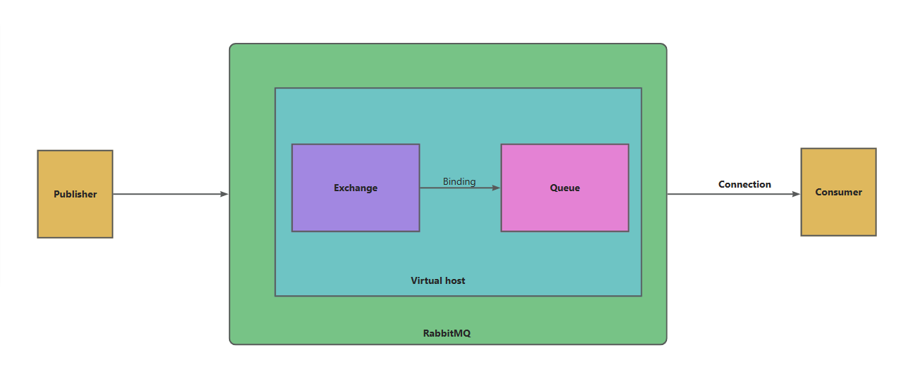
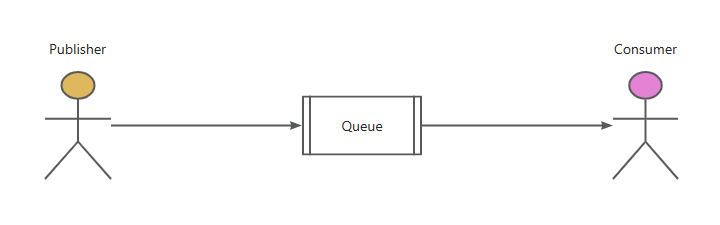
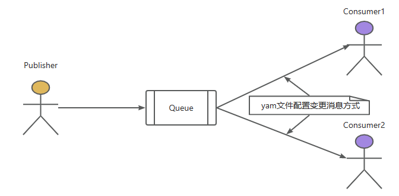
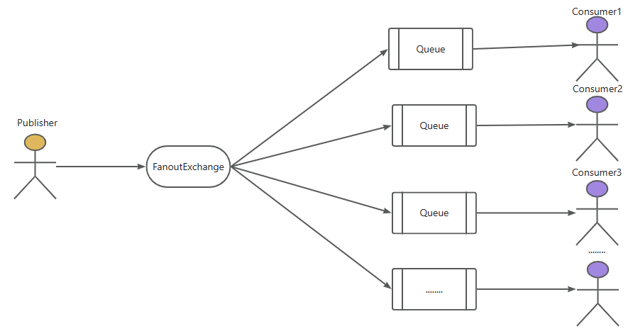
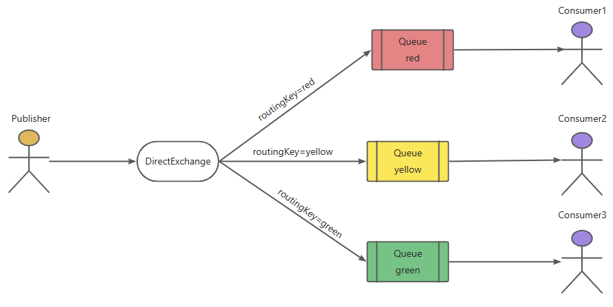
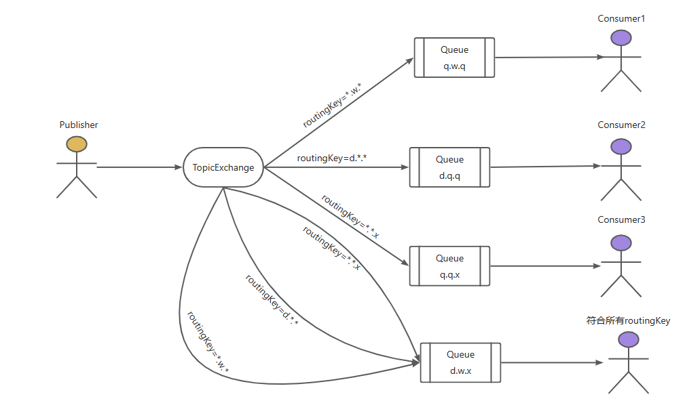

# RabbitMQ

## 一、什么是RabbitMQ

[Spring AMQP官网](https://spring.io/projects/spring-amqp/)

该技术为Spring AMQP的一种

理解RabbitMQ前我们先认识三个概念：生产者、消费者、代理

没错，RabbitMQ就是最特殊的那个---代理，可以把RabbitMQ想象为一个拍卖员，生产者委托卖货，消费者出钱买货，而代理则作为拍卖行负责双方的交易达成。

> 异步调用：
>
> 无需担心其他服务的失败而影响主服务的运行

- ### 优点

  1.耦合低，扩展功能方便

  2.性能高，不会因为调用该接口影响主业务的效率

  3.隔离性，每个队列都有自己的交换机，确保数据不会冲突

  4.支持消息持久化，即使服务器宕机重启也能保证消息可靠性

  5.不存在级联失败

- ### 缺点

  1.时效性差

## 二、RabbitMQ运作模式

``执行运作前先绑定（Binding），就是一套规则，为整体的操作做前置准备``

看图前先介绍一下各方代表：

- Publisher：生产者
- Consumer：消费者
- Virtual host：本质为一个RabbitMQ服务器
  - Exchange：交换器。相当于服务器中的组件，用于操作数据
  - Queue：队列。存储运送的信息



## 三、RabbitMQ的五种运行模式（快速开始）

每种模式取决于不同的需求，根据需求来决定自己使用哪种运行模式。

> 前置依赖

```xml
		<!--AMQP依赖，包含RabbitMQ-->
        <dependency>
            <groupId>org.springframework.boot</groupId>
            <artifactId>spring-boot-starter-amqp</artifactId>
        </dependency>
```

> yml文件链接配置

```yml
spring:
  rabbitmq:
    host: 192.168.138.100	# 你的虚拟机IP
    port: 5672	# 端口
    virtual-host: /hmall	# 虚拟主机，别人提供或者提前创建
    username: dwx	# 用户名
    password: 123	# 密码
```

> config1.交换机Exchange、队列Queue、绑定Binding配置

``交换机配置``

```java
	//创建一个名为fanout.Exchange的交换机
	@Bean
    public FanoutExchange fanoutExchange(){
        return new FanoutExchange("fanout.Exchange");
    }
```

``队列配置``

```java
	//创建方式1
	@Bean
    public Queue fanoutQueue1(){
        return new Queue("fanout.Queue1");
    }

	//创建方式2
    @Bean
    public Queue fanoutQueue2(){
        return QueueBuilder.durable("fanout.Queue2").build();
    }
```

``绑定配置``

```java
	//将fanout.Queue1绑定到fanout.Exchange
	@Bean
    public Binding fanoutBinding1(){
        return BindingBuilder.bind(fanoutQueue1()).to(fanoutExchange());
    }
```

> config2.注解配置交换机Exchange、队列Queue、绑定Binding

```java
    //用在监听方法上，直接创建交换机并绑定队列
    @RabbitListener(bindings = {
            @QueueBinding(
                    value = @Queue(name = "fanout.Queue2"),
                    exchange = @Exchange(name = "fanout.Exchange",
                                         type = ExchangeTypes.FANOUT),
                                         key = "***"
            )
    })
```

> 操作工具类

1.SpringAMQP自身也封装`AmqpTemplate`工具

2.RabbitMQ封装了`RabbitTemplate`工具

都可以用于发送消息，操作前注入该工具类,代码交互发送用`convertAndSend（）`方法，不同参数代表不同含义

> 接受不同的数据类型，完成后可以直接发送各种类型数据

``导入依赖转换工具包``

```xml
		<dependency>
            <groupId>com.fasterxml.jackson.dataformat</groupId>
            <artifactId>jackson-dataformat-xml</artifactId>
            <version>2.9.10</version>
        </dependency>
```

``配置类``

```java
public class MessageConverterConfig {
    @Bean
    public MessageConverter messageConverter() {
        return new Jackson2JsonMessageConverter();
    }
}
```

### 1.简单模式（Simple）：一个生产者，一个消费者

最简单的消息模式，一个生产者，一个消费者和一个队列，生产者向队列里发送消息，消息者从队列中获取消息并消费。如图：



``生产者``

```java
	@Test
    public void testFanoutQueue() {
        String queueName = "fanout.Queue1";
        rabbitTemplate.convertAndSend
            (queueName,User.builder().name("dwx").age(25).id(1).build());
    }
```

``消费者``

```java
	@RabbitListener(queues = "fanout.Queue1")
    public void listenSimpleQueueMessage2(Object msg) {
        System.out.println(msg);
    }
```

### 2.工作队列模式（Work Queue）： 多个消费者竞争消息

与简单模式相比，工作模式多了一些消费者。该模式采用**DirectExchange**，多用与处理消息较多的情况。

如图：



- ### **特点**

  1.一个队列对应多个消费者

  2.每条消息只能被一个消费者消费

  3.消息队列默认采用轮询的方式将消息平均发送给消费者

因为工作队列**默认采用轮询方式**发送消息，这时工作队列模式就有了一个问题，实际业务场景中我们不可能确保每个接口响应都是一致的，有的接口快有的接口慢，就会出现快的消费者等待慢的消费者消费消息的情况，造成了资源浪费。为了解决这个问题，就使用配置文件改变工作队列默认的发送消息方式，如下：

```yml
spring:
  rabbitmq:
    listener:
      simple:
        prefetch: 1 #每次拉取一条，消费完成后，立刻再拉取一条
```

改变完成后，消费者之间就变成了一种**竞争关系**。当快的消费者消费完成后，不会等待慢的消费者，而是立刻再次拉取一条消息。这样，资源浪费问题就完美解决了。

> 代码方面比之简单模式多创建方法绑定了队列而已

### 3.发布/订阅模式（Publish/Subscribe）：一个生产者，多个消费者

这个模式是为每一个消费者都创建了一个**独属于自己的队列**，从而达到让一条消息让所有消费者都接受到。在开发过程中，有一些消息需要不同消费者进行不同的处理。

如图：



- ### 特点

  1.生产者将消息发送给交换机，交换机将消息转发到绑定此交换机的**每个队列**中。

  2.**发布订阅模式的交换机能将消息发送给多个队列**。发布订阅模式使用FanoutExchange交换机。

> 交换机为fanout类型，无条件群发

``生产者``

```java
	/**
     * 发布订阅模式
     * @throws Exception
     */
    @Test
    public void fanoutTest() throws Exception {
        String fanoutExchange = "fanout.exchange";
        String message = "Hello, FanoutMessage";
        //参数一：交换机
        //参数二：路由Key
        //参数三：消息
        rabbitTemplate.convertAndSend(fanoutExchange, "", message);
    }
```

``消费者``

消费者代码同简单模式一样

### 4.路由模式（Routing）：根据路由键将消息转发到对应队列

使用发布订阅模式时，所有消息都会发送到绑定的队列中，但很多时候，不是所有消息都无差别的发布到所有队列中，该模式比之发布订阅模式多了一个指定的routingKey，这个用来辨别发送给哪一个队列。

如图：



- ### 特点

  1.每个队列绑定路由关键字**RoutingKey**

  2.生产者将带有RoutingKey的消息发送给交换机，交换机**根据RoutingKey**转发到指定队列。路由模式使用**DirectExchange**交换机。

> 交换机为direct类型，根据重载的方法来实现绑定routingKey

``生产者``

```java
	@Test
    public void testDirectQueue() {
        String exchangeName = "direct.Queue1";
        rabbitTemplate.convertAndSend(exchangeName,"red","red message");
        rabbitTemplate.convertAndSend(exchangeName,"yellow","red message");
        rabbitTemplate.convertAndSend(exchangeName,"green","red message");
    }
```

``消费者``

消费者代码同简单模式一样

### 5.通配符模式（Topics）：使用通配符匹配路由键

这个和路由模式大同小异，就是一个routingKey更为灵活了，可以用通配符`*`来表示任意字符串，中间用`.`来隔开

如图：



- ### 通配符规则

  1.消息设置RoutingKey时，RoutingKey由多个单词构成，中间以`.`分割。

  2.队列设置RoutingKey时，`#`可以匹配任意多个单词，`*`可以匹配任意一个单词。

> 交换机为topic类型,比之路由模式更加灵活

``生产者``

```java
	@Test
    public void testDirectQueue() {
        String exchangeName = "direct.Queue1";
        rabbitTemplate.convertAndSend(exchangeName,"q.w.q","red message");
        rabbitTemplate.convertAndSend(exchangeName,"d.q.q","red message");
        rabbitTemplate.convertAndSend(exchangeName,"q.q.x","red message");
        rabbitTemplate.convertAndSend(exchangeName,"d.w.x","red message");
    }
```

``消费者``

消费者代码同简单模式一样