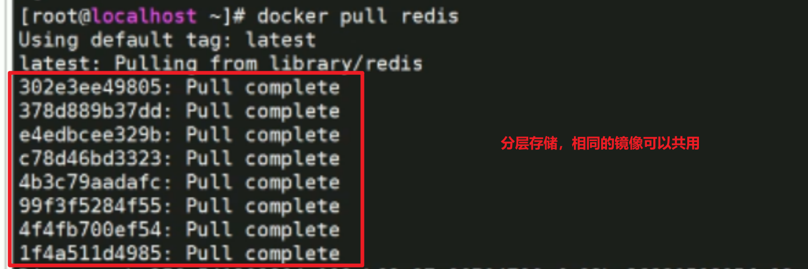
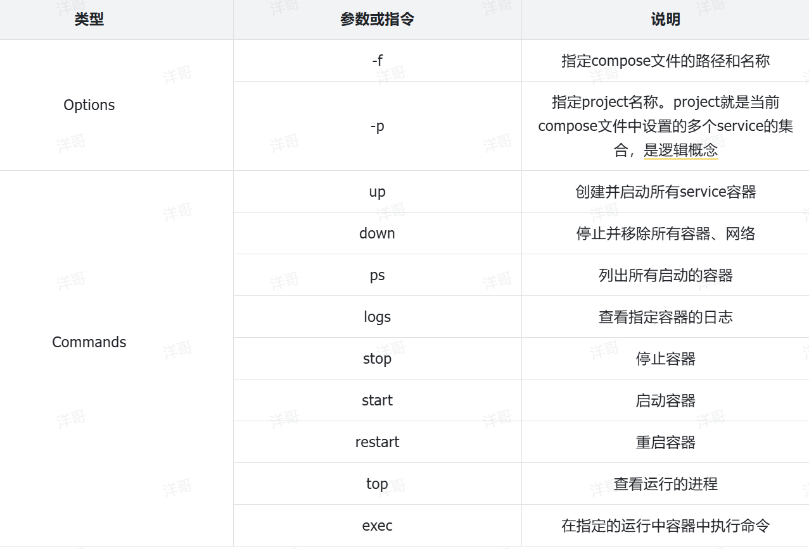

# 一、Docker

## 1、镜像结构

镜像是分层存储的




## 2、构建自定义镜像

1. 准备好要构建镜像的Dockerfile文件

```shell
# 基础镜像
FROM openjdk:11.0-jre-buster
# 设定时区
ENV TZ=Asia/Shanghai
RUN ln -snf /usr/share/zoneinfo/$TZ /etc/localtime && echo $TZ > /etc/timezone
# 拷贝jar包
COPY docker-demo.jar /app.jar
# 入口
ENTRYPOINT ["java", "-jar", "/app.jar"]
```


2. 构建镜像

```shell
docker build -t 镜像名:版本 .
```

> 上述命令的 . 表示Dockerfile文件所在的路径


## 3、网络


## 4、部署Java项目

1、清理之前所有的容器

```shell
cd /root

docker stop $(docker ps -qa)

docker rm $(docker ps -qa)
```


2、创建网络

```shell
docker network create hmall
```


3、构建mysql容器

```shell
docker run -d \
  --name mysql \
  -p 3306:3306 \
  -e TZ=Asia/Shanghai \
  -e MYSQL_ROOT_PASSWORD=123 \
  -v ./mysql/data:/var/lib/mysql \
  -v ./mysql/conf:/etc/mysql/conf.d \
  -v ./mysql/init:/docker-entrypoint-initdb.d \
  --network hmall \
  mysql
```


4、部署Java应用

1. 修改配置

   > 1. 修改 application.yml 激活环境为 dev
   >
   > 2. 修改 application-dev.yml
   >
   >    ```yml
   >    db:
   >      host: mysql #mysql容器名称
   >      pw: #mysql数据库密码
   >    ```

2. IDEA跳过测试并打包

3. 上传资料到服务器

   > Dockerfile 文件、Java应用Jar包

4. 部署应用

   > 1. 自定义镜像
   >
   >    ```shell
   >    docker build -t hmall .
   >    ```
   >
   > 2. 启动窗口
   >
   >    ```shell
   >    docker run -d --name hmall --network hmall -p 8080:8080 hmall
   >    ```
   >
   > 3. 测试
   >
   >    ```shell
   >    http://192.168.138.100:8080/search/list
   >    ```


5、部署前端应用

1. 把资料中的nginx上传到服务器

2. 部署nginx容器

   ```shell
   docker run -d \
     --name nginx \
     -p 18080:18080 \
     -p 18081:18081 \
     -v /root/nginx/html:/usr/share/nginx/html \
     -v /root/nginx/nginx.conf:/etc/nginx/nginx.conf \
     --network hmall \
     nginx
   ```

   

## 5、Docker-Compose

### 1、概述

​	是Docker官方考虑到Docker命令过多，参数复杂，而开源一个通过配置文件来进行容器的编排与部署的组件


### 2、配置文件

- docker-compose.yml

  例如：

```yml
#version: "3"  #旧版本要这个属性，写3。。。最新版本，不需要这个属性

services:
  mysql:
    image: mysql
    container_name: mysql
    ports:
      - "3306:3306"
    environment:
      TZ: Asia/Shanghai
      MYSQL_ROOT_PASSWORD: 123
    volumes:
      - "./mysql/conf:/etc/mysql/conf.d"
      - "./mysql/data:/var/lib/mysql"
      - "./mysql/init:/docker-entrypoint-initdb.d"
    networks:
      - hm-net
  hmall:
    build:
      context: .
      dockerfile: Dockerfile
    container_name: hmall
    ports:
      - "8080:8080"
    networks:
      - hm-net
    depends_on:
      - mysql
  nginx:
    image: nginx
    container_name: nginx
    ports:
      - "18080:18080"
      - "18081:18081"
    volumes:
      - "./nginx/nginx.conf:/etc/nginx/nginx.conf"
      - "./nginx/html:/usr/share/nginx/html"
    depends_on:
      - hmall
    networks:
      - hm-net
networks:
  hm-net:
    name: hmall
```


### 3、常用命令




```shell
docker-compose up -d

docker-compose down

docker-compose ps

docker-compose logs -f 容器名称

docker-compose exec -it 容器名称 bash
```


